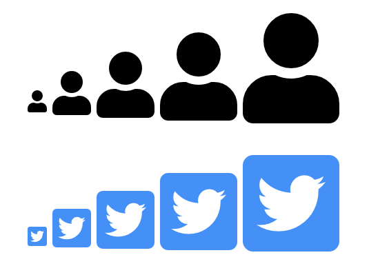
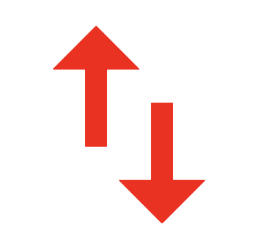

# Adding Font, SVG, and CSS Icons to a website

Making use of icons within a webpage is done through several different methods. Three popular methods include using an icon font, svg graphics, or purely css generated icons. Using any of the three methods has the advantage of maintaining a clear and sharp resolution on different devices and when scaled differently. This is achieved by using formats that avoid fixed image sizes or use bitmaps.

## Icon Fonts

One of the best ways to add high-quality icons to a website is by using an icon font. There are several font icon options available including [Font Awesome](https://fontawesome.com), [Bootstrap Icons](https://icons.getbootstrap.com), and [Materialize Icons](https://materializecss.com/icons.html). Each offer several ways to include them into a website. This article will focus on how to incorporate these font icon libraries into a static webpage, not through build systems or other javascript frameworks like React or Vue. Adding font icons from the above sources is fairly straight forward.

The options to add icon fonts into a webpage include downloading and manually adding the files to a project directory or to reference the source files via a CDN. Either option will accomplish the same result of making the icon fonts available for use within the website project.

#### Local CSS and Font Files

After downloading the files needed to load and reference files locally within a project, they can be added to the project directory structure. Each font icon set has instructions on how to add and reference the files, which is helpful to get things setup. For example, for Font Awesome, the process involves:

- [downloading source files](https://fontawesome.com/how-to-use/on-the-web/setup/hosting-font-awesome-yourself) from its website and placing at least the files for the `/webfonts` and `/css` them into the correct location.
- Referencing the CSS file within the `<head>` of an HTML document, as shown below.

```html
<head>
  <meta charset="UTF-8" />
  <meta http-equiv="X-UA-Compatible" content="IE=edge" />
  <meta name="viewport" content="width=device-width, initial-scale=1.0" />
  <title>CSS Fonts</title>
  <link rel="stylesheet" href="css/all.css" />
</head>
```

- Using the appropriate CSS classes to apply style properties to display the font icons as desired

```html
<body>
  <!-- uses solid style -->
  <i style="font-size: 5rem" class="fas fa-user"></i>

  <!--brand icon-->
  <i
    style="font-size: 5rem; color: dodgerblue"
    class="fab fa-twitter-square"
  ></i>
</body>
```

Since the icons that are being rendered are actually just part of a font file, similar to common typographic fonts, some of the styles that can be applied to those types of fonts can also be applied to icon fonts. In the example above, the inline styling for `font-size` and `color` are applied and produce the expected results. This gives some nice flexibility when using icon fonts.



The fonts for Font Awesome are also provided in a variety of different file types, including Embedded OpenType (EOT), TrueType (TTF), and Web Open Font Format (WOFF) versions 1 and 2. The fonts for Bootstrap icons are available in woff and woff2 file formats. For Materialize icons, the process is a little different. Since the icons used are provided through Google Fonts, they make use of the Google Fonts API to request the fonts: `https://fonts.googleapis.com/icon?family=Material+Icons` and then request woff and woff2 font icon files.

#### Requesting Font Icons via a CDN service

All three of the vendors mentioned above also provide an option to reference their fonts via a CDN (content delivery network). For Font Awesome, there is a preliminary step to sign up or log into their website and create a kit that can be used. Since Font Awesome also provides a paid subscription service for additional font icons and expanded options, this step is necessary. However, developers can also make use of the free tier and still make use a wide range of icons.

To add the different vendor icon fonts via a CDN, the following code is used:

```html
<head>
  <meta charset="UTF-8" />
  <meta http-equiv="X-UA-Compatible" content="IE=edge" />
  <meta name="viewport" content="width=device-width, initial-scale=1.0" />
  <title>CSS Icons</title>
  <!-- Font Awesome -->
  <script
    src="https://kit.fontawesome.com/unique-key-goes-here.js"
    crossorigin="anonymous"
    defer
  ></script>

  <!-- Bootstrap Icons -->
  <link
    rel="stylesheet"
    href="https://cdn.jsdelivr.net/npm/bootstrap-icons@1.5.0/font/bootstrap-icons.css"
  />

  <!-- Materialize Icons -->
  <link
    href="https://fonts.googleapis.com/icon?family=Material+Icons"
    rel="stylesheet"
  />
</head>
```

Once referenced and loaded into the browser, it's possible to make use of the fonts following the requirements specified in the documentation for each vendor.

## SVG Graphic Icons

Although using icon fonts offers a lot of flexibility, especially when it comes to styling, there are some downsides. First, there may be cases where only one or two icons is needed for an entire website. However, with icon fonts, they are typically loaded as full icon sets, including icons not needed, which makes the file downloaded much larger than necessary.

SVG graphics offers an alternative to icon fonts. For example, [Font Awesome](https://github.com/FortAwesome/Font-Awesome), [Bootstrap](https://github.com/twbs/icons), and [Google Fonts](https://github.com/google/material-design-icons) all have GitHub repositories where they make all their source files available, including individual SVG files for all the icons they offer.

It's possible to include individual SVG files on websites and manipulate them to achieve a desired look and feel. The easiest way to add an SVG file to a webpage is by saving the file locally and referencing it in an `` element. For example, the following will display the Instagram logo as a SVG file via the `` element.

```html

```

A drawback to this approach is that it's not easy to manipulate the styling of the SVG icon using CSS, although the `filter` property does provide an option to change color of an SVG that is the source of an `` element. Another option is to add the SVG file as an inline element on the HTML page. Doing this opens many more [options to working with SVG and styling](https://css-tricks.com/using-svg/).

For example, an SVG icon for two arrows from Google Font Icons has the following source code.

```html
<svg
  xmlns="http://www.w3.org/2000/svg"
  height="24px"
  viewBox="0 0 24 24"
  width="24px"
  fill="#000000"
>
  <path d="M0 0h24v24H0V0z" fill="none" />
  <path
    d="M16 17.01V10h-2v7.01h-3L15 21l4-3.99h-3zM9 3L5 6.99h3V14h2V6.99h3L9 3zm7 14.01V10h-2v7.01h-3L15 21l4-3.99h-3zM9 3L5 6.99h3V14h2V6.99h3L9 3z"
  />
</svg>
```

Although this is fairly short, other SVG graphics can be much longer depending on its complexity. However, since the SVG graphic is defined as an inline element, it's possible to change the styling with CSS. To do this, first some of the inline styling is removed and a few classes are added. The `.big-icon` class is added to the `<svg>` root element and a `.red-icon` class is added to the second `<path>` element.

```html
<svg xmlns="http://www.w3.org/2000/svg" viewBox="0 0 24 24" class="big-icon">
  <path d="M0 0h24v24H0V0z" fill="none" />
  <path
    class="red-icon"
    d="M16 17.01V10h-2v7.01h-3L15 21l4-3.99h-3zM9 3L5 6.99h3V14h2V6.99h3L9 3zm7 14.01V10h-2v7.01h-3L15 21l4-3.99h-3zM9 3L5 6.99h3V14h2V6.99h3L9 3z"
  />
</svg>
```

Next, the CSS is applied to change the SVG graphic size and color.

```css
.big-icon {
  height: 12rem;
}
.red-icon {
  fill: red;
}
```

The resulting graphic is larger and red.



There are many services that provide SVG graphics - both free and paid - for use. [Simple Icons](https://simpleicons.org/), [SVG Repo](https://www.svgrepo.com/), and [Flaticons](https://www.flaticon.com/) are all good sources for SVG icons. The first two have free options.

## CSS Only Icons

Another interesting option for adding icons to a webpage is with CSS only icons. These are icons that are created using only CSS definitions. Due to the way these icons are created, they are relatively small in size and easy to add to a webpage. A very good library for CSS only icons is [CSS Icons](https://css.gg) by Astrit Malsija. To add an icon for an arrow pointing up and to the left, the following CSS code is all that is required.

```css
.gg-arrow-top-left {
  box-sizing: border-box;
  position: relative;
  display: block;
  width: 8px;
  height: 8px;
  transform: scale(var(--ggs, 1));
  border-top: 2px solid;
  border-left: 2px solid;
}

.gg-arrow-top-left::after {
  content: '';
  display: block;
  box-sizing: border-box;
  position: absolute;
  width: 14px;
  height: 2px;
  background: currentColor;
  transform: rotate(45deg);
  top: 3px;
  left: -3px;
}
```

Once defined, the icon can be referenced in the HTML, `<i class="gg-arrow-up-r"></i>` and displayed. Since the icons are made with CSS, they can be manipulated by CSS to add additional styling like color and other options listed in the [official documentation](https://github.com/astrit/css.gg).

Other CSS only icon libraries include [Icono](https://saeedalipoor.github.io/icono/) and [CSS Icon](https://cssicon.space).

## Conclusion

All the options listed in this article are viable options to consider. Depending on the needs of the website, one may be better than the other. If the need is only to add one or two icons for something like a social media brand, then using an SVG icon option may be best. If one or two very simple icons is needed for an HTML page, then CSS Icons may be best. If multiple icons are needed and require complex arrangement within forms and buttons, then a library like Font Awesome many be the best option. Thankfully there are several options and all of them are fairly easy to implement and use.
